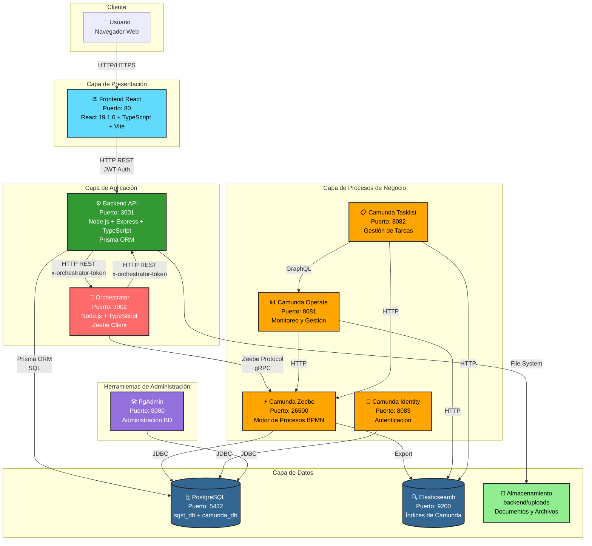
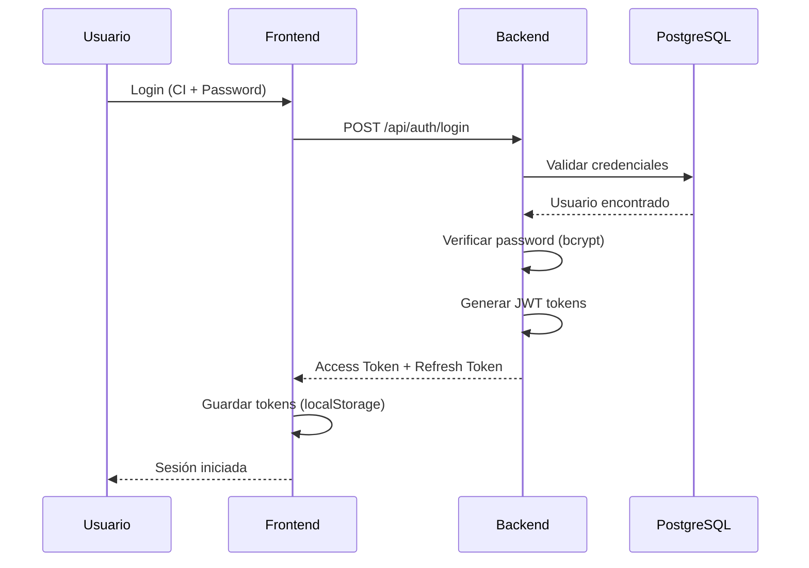
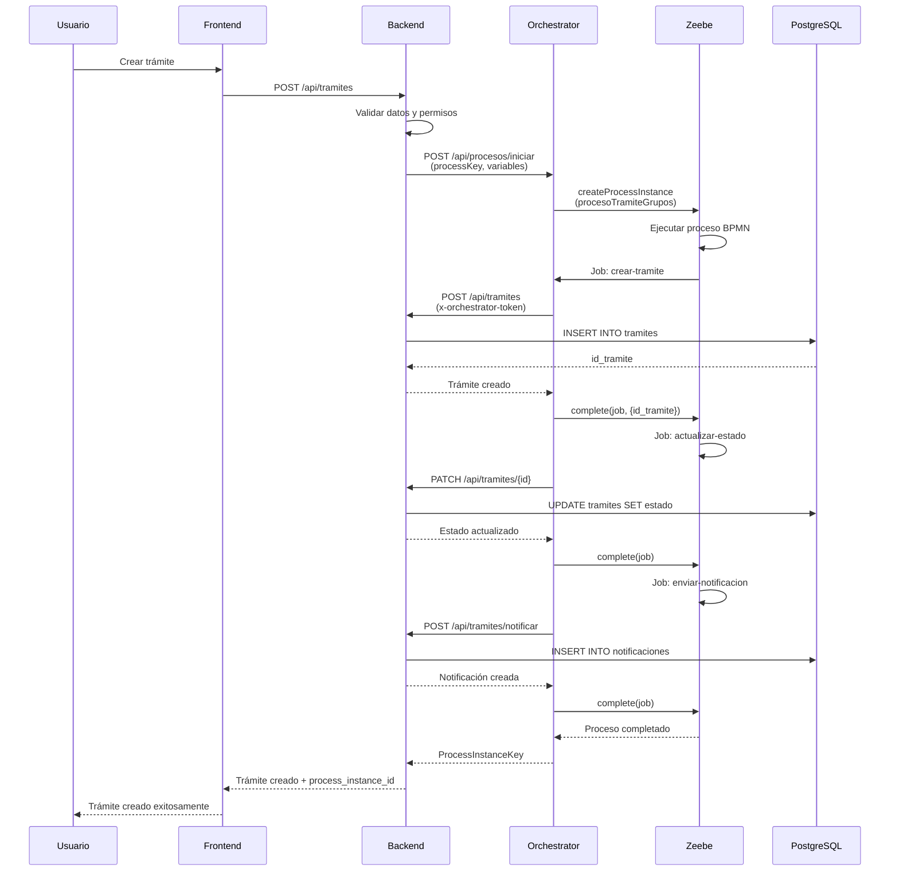
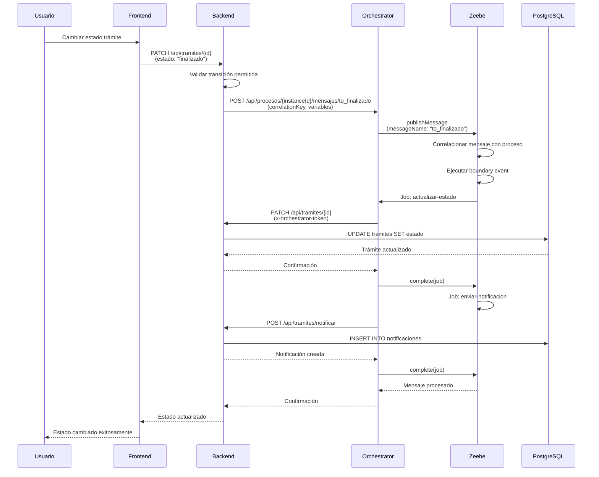
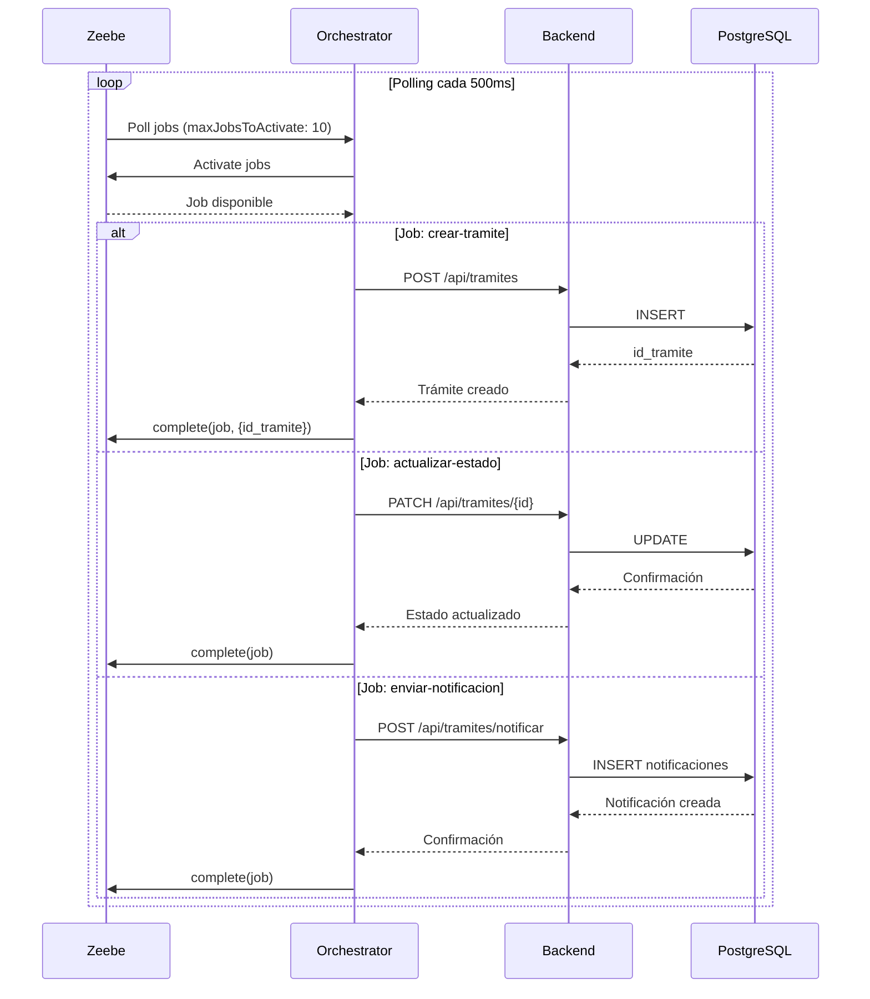

# Diagrama de Arquitectura - Sistema SGST

## Arquitectura General del Sistema



---

## Flujo de Comunicación Detallado

### 1. Flujo de Autenticación



### 2. Flujo de Creación de Trámite (con Camunda)



### 3. Flujo de Cambio de Estado de Trámite



### 4. Flujo de Job Workers (Asíncrono)



---

## Componentes y Tecnologías

### Frontend
- **Tecnología**: React 19.1.0, TypeScript, Vite
- **Puerto**: 80
- **Comunicación**: HTTP REST con Backend
- **Autenticación**: JWT almacenado en localStorage
- **Estado**: Context API (AuthContext, ToastContext)

### Backend API
- **Tecnología**: Node.js, Express, TypeScript
- **Puerto**: 3001
- **ORM**: Prisma
- **Autenticación**: JWT (access token 8h, refresh token 7d)
- **Seguridad**: bcrypt para passwords, middleware de autenticación
- **Comunicación**:
  - HTTP REST con Frontend
  - HTTP REST con Orchestrator (token especial)
  - Prisma ORM con PostgreSQL

### Orchestrator
- **Tecnología**: Node.js, TypeScript
- **Puerto**: 3002
- **Cliente**: Zeebe Node.js Client
- **Función**: Intermediario entre Camunda y Backend
- **Job Workers**:
  - `crear-tramite`: Crea trámites en el backend
  - `actualizar-estado`: Actualiza estados de trámites
  - `enviar-notificacion`: Envía notificaciones automáticas
- **Configuración**:
  - Poll interval: 500ms
  - Max jobs to activate: 10
  - Timeout: 30 segundos
- **Comunicación**:
  - Zeebe Protocol (gRPC) con Camunda Zeebe
  - HTTP REST con Backend (x-orchestrator-token)

### Camunda 8 (Zeebe)
- **Tecnología**: Camunda Zeebe 8.5.0
- **Puerto**: 26500 (Gateway), 26501 (Gateway Management)
- **Función**: Motor de procesos BPMN
- **Proceso Principal**: `procesoTramiteGrupos`
- **Comunicación**:
  - Zeebe Protocol (gRPC) con Orchestrator
  - JDBC con PostgreSQL (camunda_db)
  - Export a Elasticsearch

### Camunda Operate
- **Puerto**: 8081
- **Función**: Monitoreo y gestión de procesos
- **Comunicación**: HTTP con Zeebe y Elasticsearch

### Camunda Tasklist
- **Puerto**: 8082
- **Función**: Gestión de tareas de usuario
- **Comunicación**: HTTP con Zeebe, Elasticsearch y Operate (GraphQL)

### Camunda Identity
- **Puerto**: 8083
- **Función**: Autenticación y autorización de Camunda
- **Comunicación**: JDBC con PostgreSQL

### PostgreSQL
- **Puerto**: 5432
- **Bases de Datos**:
  - `sgst_db`: Datos de la aplicación (usuarios, trámites, fichas, etc.)
  - `camunda_db`: Datos de procesos BPMN
- **ORM**: Prisma para sgst_db
- **Gestión**: PgAdmin (puerto 8080)

### Elasticsearch
- **Puerto**: 9200
- **Función**: Índices para búsqueda y monitoreo de Camunda
- **Comunicación**: HTTP con Zeebe, Operate y Tasklist

### Almacenamiento de Archivos
- **Ubicación**: `backend/uploads/`
- **Gestión**: Sistema de archivos del servidor
- **Límite**: 10MB por archivo
- **Formatos**: PDF, imágenes, documentos de oficina

---

## Patrones Arquitectónicos

### 1. Arquitectura en Capas
- **Capa de Presentación**: Frontend React
- **Capa de Aplicación**: Backend API + Orchestrator
- **Capa de Procesos**: Camunda Zeebe
- **Capa de Datos**: PostgreSQL + Elasticsearch + File Storage

### 2. Separación de Responsabilidades
- **Backend**: Lógica de negocio y persistencia
- **Orchestrator**: Integración con Camunda (desacoplamiento)
- **Camunda**: Orquestación de procesos de negocio

### 3. Comunicación Asíncrona
- **Job Workers**: Procesamiento asíncrono de tareas
- **Polling**: Orchestrator consulta jobs cada 500ms
- **Mensajes**: Eventos de mensaje para correlación

### 4. Seguridad
- **Autenticación JWT**: Tokens con expiración
- **Token Especial**: x-orchestrator-token para comunicación interna
- **Middleware de Autenticación**: Validación en todas las rutas protegidas
- **Encriptación**: Contraseñas con bcrypt

### 5. Escalabilidad
- **Orchestrator**: Puede escalarse independientemente
- **Job Workers**: Procesamiento paralelo (hasta 10 jobs simultáneos)
- **Base de Datos**: Índices optimizados para consultas frecuentes

---

## Endpoints Principales

### Backend API
- `POST /api/auth/login` - Autenticación
- `GET /api/auth/me` - Usuario actual
- `POST /api/tramites` - Crear trámite
- `PATCH /api/tramites/:id` - Actualizar trámite
- `GET /api/tramites` - Listar trámites
- `POST /api/fichas` - Crear ficha
- `GET /api/usuarios` - Listar usuarios
- `GET /api/notificaciones` - Obtener notificaciones
- `GET /api/reportes` - Generar reportes

### Orchestrator
- `POST /api/procesos/iniciar` - Iniciar proceso BPMN
- `POST /api/procesos/:instanceId/mensajes/:messageName` - Correlacionar mensaje
- `POST /api/procesos/desplegar` - Desplegar diagrama BPMN
- `GET /health` - Health check

---

## Flujos de Datos Principales

### 1. Creación de Trámite
```
Frontend → Backend → Orchestrator → Zeebe → Job Worker → Backend → PostgreSQL
                                                              ↓
                                                         Notificaciones
```

### 2. Cambio de Estado
```
Frontend → Backend → Orchestrator → Zeebe (Mensaje) → Job Workers → Backend → PostgreSQL
```

### 3. Consulta de Datos
```
Frontend → Backend → PostgreSQL → Backend → Frontend
```

### 4. Subida de Documentos
```
Frontend → Backend → File System (uploads/) → Backend → PostgreSQL (metadata)
```

---

## Configuración de Red

### Docker Network: `sgst_network`
- Tipo: Bridge
- Todos los servicios están en la misma red
- Comunicación interna por nombres de servicio

### Puertos Expuestos
- **80**: Frontend (HTTP)
- **3001**: Backend API
- **3002**: Orchestrator
- **5432**: PostgreSQL
- **8080**: PgAdmin
- **8081**: Camunda Operate
- **8082**: Camunda Tasklist
- **8083**: Camunda Identity
- **9200**: Elasticsearch
- **26500**: Zeebe Gateway
- **26501**: Zeebe Gateway Management

---

## Optimizaciones de Rendimiento

### Orchestrator
- Poll interval: 500ms (consultas frecuentes)
- Max jobs to activate: 10 (procesamiento paralelo)
- Timeout: 30 segundos por job
- TimeToLive de mensajes: 30 segundos

### Backend
- Timeouts reducidos: 5 segundos para llamadas HTTP
- Índices en campos frecuentemente consultados
- Consultas optimizadas con Prisma

### Base de Datos
- Índices en relaciones y campos de búsqueda
- Validación de integridad referencial
- Cascadas de eliminación donde aplica

---

## Monitoreo y Salud

### Health Checks
- **Backend**: `GET /health`
- **Orchestrator**: `GET /health`
- **PostgreSQL**: `pg_isready`
- **Elasticsearch**: `curl /_cluster/health`
- **Zeebe**: `curl /actuator/health`
- **Operate/Tasklist/Identity**: `curl /actuator/health`

### Logging
- Todos los servicios registran acciones importantes
- Auditoría completa en base de datos
- Logs de errores y advertencias

---

**Documento generado para el Sistema SGST**
**Fecha: Enero 2025**


