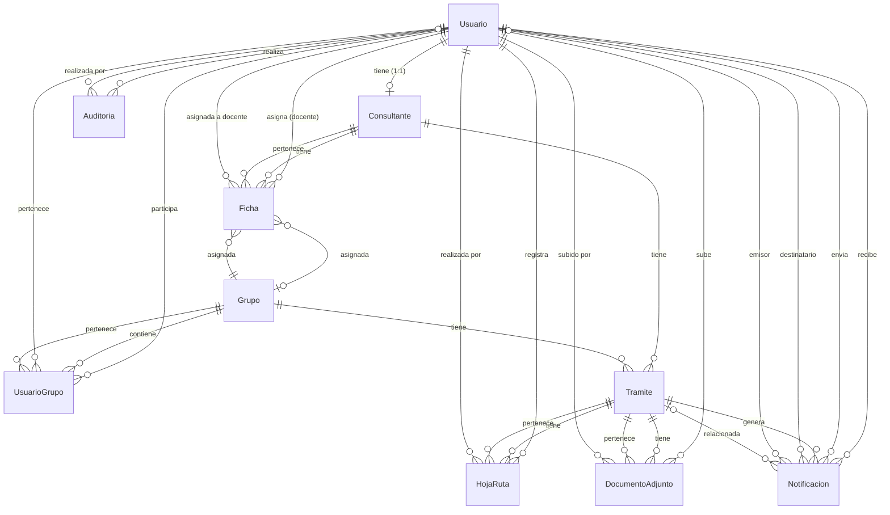

# Modelo Entidad-Relación (MER) - Sistema SGST

## Diagrama MER

---

## Entidades y Atributos

### 1. USUARIO
**Descripción:** Representa a todos los usuarios del sistema (estudiantes, docentes, consultantes, administradores).

| Atributo | Tipo | Restricciones | Descripción |
|----------|------|---------------|-------------|
| id_usuario | Int | PK, Auto | Identificador único del usuario |
| nombre | String | NOT NULL | Nombre completo del usuario |
| ci | String | NOT NULL, UNIQUE | Cédula de identidad (identificador único) |
| domicilio | String | NOT NULL | Dirección de residencia |
| telefono | String | NOT NULL | Número de teléfono |
| correo | String | NOT NULL, UNIQUE | Correo electrónico (identificador único) |
| password | String | NULLABLE | Contraseña hasheada con bcrypt |
| rol | String | NOT NULL, DEFAULT 'estudiante' | Rol: estudiante, docente, consultante, administrador |
| nivel_acceso | Int | NULLABLE | Para administradores: 1=administrativo, 3=sistema |
| activo | Boolean | NOT NULL, DEFAULT true | Estado activo/inactivo |
| semestre | String | NULLABLE | Semestre del estudiante |
| refresh_token | String | NULLABLE | Token JWT de refresco |
| created_at | DateTime | NOT NULL, DEFAULT now() | Fecha de creación |
| updated_at | DateTime | NOT NULL, AUTO UPDATE | Fecha de última actualización |

**Relaciones:**
- 1:1 con Consultante (un usuario puede ser un consultante)
- 1:N con UsuarioGrupo (un usuario puede participar en varios grupos)
- 1:N con Auditoria (un usuario puede realizar múltiples acciones auditadas)
- 1:N con HojaRuta (un usuario puede registrar múltiples actuaciones)
- 1:N con DocumentoAdjunto (un usuario puede subir múltiples documentos)
- 1:N con Ficha (un docente puede tener múltiples fichas asignadas)
- 1:N con Notificacion (recibidas) (un usuario puede recibir múltiples notificaciones)
- 1:N con Notificacion (enviadas) (un usuario puede enviar múltiples notificaciones)

---

### 2. CONSULTANTE
**Descripción:** Representa a los consultantes que solicitan servicios de trabajo social.

| Atributo | Tipo | Restricciones | Descripción |
|----------|------|---------------|-------------|
| id_consultante | Int | PK, Auto | Identificador único del consultante |
| id_usuario | Int | FK, NOT NULL, UNIQUE | Referencia a Usuario (relación 1:1) |
| est_civil | String | NOT NULL | Estado civil |
| nro_padron | Int | NOT NULL, UNIQUE | Número de padrón (identificador único) |
| created_at | DateTime | NOT NULL, DEFAULT now() | Fecha de creación |
| updated_at | DateTime | NOT NULL, AUTO UPDATE | Fecha de última actualización |

**Relaciones:**
- N:1 con Usuario (un consultante pertenece a un usuario)
- 1:N con Tramite (un consultante puede tener múltiples trámites)
- 1:N con Ficha (un consultante puede tener múltiples fichas)

---

### 3. GRUPO
**Descripción:** Representa grupos de trabajo formados por estudiantes y docentes.

| Atributo | Tipo | Restricciones | Descripción |
|----------|------|---------------|-------------|
| id_grupo | Int | PK, Auto | Identificador único del grupo |
| nombre | String | NOT NULL | Nombre del grupo |
| descripcion | String | NULLABLE | Descripción del grupo |
| activo | Boolean | NOT NULL, DEFAULT true | Estado activo/inactivo |
| created_at | DateTime | NOT NULL, DEFAULT now() | Fecha de creación |
| updated_at | DateTime | NOT NULL, AUTO UPDATE | Fecha de última actualización |

**Relaciones:**
- 1:N con Tramite (un grupo puede tener múltiples trámites)
- 1:N con UsuarioGrupo (un grupo puede tener múltiples miembros)
- 1:N con Ficha (un grupo puede tener múltiples fichas asignadas)

---

### 4. USUARIO_GRUPO
**Descripción:** Tabla intermedia que relaciona usuarios con grupos (relación muchos a muchos).

| Atributo | Tipo | Restricciones | Descripción |
|----------|------|---------------|-------------|
| id_usuario_grupo | Int | PK, Auto | Identificador único |
| id_usuario | Int | FK, NOT NULL | Referencia a Usuario |
| id_grupo | Int | FK, NOT NULL | Referencia a Grupo |
| rol_en_grupo | String | NOT NULL | Rol: responsable, asistente, estudiante |
| created_at | DateTime | NOT NULL, DEFAULT now() | Fecha de creación |
| updated_at | DateTime | NOT NULL, AUTO UPDATE | Fecha de última actualización |

**Restricciones:**
- UNIQUE(id_usuario, id_grupo) - Un usuario no puede estar dos veces en el mismo grupo
- INDEX(id_grupo)
- INDEX(id_usuario)

**Relaciones:**
- N:1 con Usuario (muchos usuarios pueden pertenecer a un grupo)
- N:1 con Grupo (un usuario puede pertenecer a muchos grupos)

---

### 5. TRAMITE
**Descripción:** Representa los trámites o casos de trabajo social gestionados por grupos.

| Atributo | Tipo | Restricciones | Descripción |
|----------|------|---------------|-------------|
| id_tramite | Int | PK, Auto | Identificador único del trámite |
| id_consultante | Int | FK, NOT NULL | Referencia a Consultante |
| id_grupo | Int | FK, NOT NULL | Referencia a Grupo |
| num_carpeta | String | NOT NULL, UNIQUE | Número de carpeta (formato: xxx/yy) |
| estado | String | NOT NULL, DEFAULT 'en_tramite' | Estado: en_tramite, finalizado, pendiente, desistido |
| observaciones | String | NULLABLE | Observaciones del trámite |
| fecha_inicio | DateTime | NOT NULL, DEFAULT now() | Fecha de inicio del trámite |
| fecha_cierre | DateTime | NULLABLE | Fecha de cierre del trámite |
| motivo_cierre | String | NULLABLE | Motivo del cierre |
| process_instance_id | String | NULLABLE | ID de instancia en Camunda |
| created_at | DateTime | NOT NULL, DEFAULT now() | Fecha de creación |
| updated_at | DateTime | NOT NULL, AUTO UPDATE | Fecha de última actualización |

**Relaciones:**
- N:1 con Consultante (un trámite pertenece a un consultante)
- N:1 con Grupo (un trámite pertenece a un grupo)
- 1:N con Notificacion (un trámite puede generar múltiples notificaciones)
- 1:N con HojaRuta (un trámite puede tener múltiples actuaciones)
- 1:N con DocumentoAdjunto (un trámite puede tener múltiples documentos)

---

### 6. FICHA
**Descripción:** Representa fichas de consulta que pueden convertirse en trámites.

| Atributo | Tipo | Restricciones | Descripción |
|----------|------|---------------|-------------|
| id_ficha | Int | PK, Auto | Identificador único de la ficha |
| id_consultante | Int | FK, NOT NULL | Referencia a Consultante |
| fecha_cita | DateTime | NOT NULL | Fecha de la cita |
| hora_cita | String | NULLABLE | Hora de la cita (formato HH:mm) |
| tema_consulta | String | NOT NULL | Tema de la consulta |
| id_docente | Int | FK, NOT NULL | Referencia a Usuario (docente) |
| numero_consulta | String | NOT NULL, UNIQUE | Número de consulta (formato: xx/yyyy) |
| estado | String | NOT NULL, DEFAULT 'standby' | Estado: pendiente, aprobado, standby, asignada, iniciada |
| id_grupo | Int | FK, NULLABLE | Referencia a Grupo (opcional) |
| observaciones | String | NULLABLE | Observaciones |
| process_instance_id | String | NULLABLE | ID de instancia en Camunda |
| created_at | DateTime | NOT NULL, DEFAULT now() | Fecha de creación |
| updated_at | DateTime | NOT NULL, AUTO UPDATE | Fecha de última actualización |

**Índices:**
- INDEX(id_consultante)
- INDEX(id_docente)
- INDEX(id_grupo)
- INDEX(estado)
- INDEX(numero_consulta)

**Relaciones:**
- N:1 con Consultante (una ficha pertenece a un consultante)
- N:1 con Usuario (una ficha está asignada a un docente)
- N:1 con Grupo (una ficha puede estar asignada a un grupo)

---

### 7. NOTIFICACION
**Descripción:** Representa notificaciones enviadas a usuarios del sistema.

| Atributo | Tipo | Restricciones | Descripción |
|----------|------|---------------|-------------|
| id_notificacion | Int | PK, Auto | Identificador único de la notificación |
| id_usuario | Int | FK, NOT NULL | Referencia a Usuario (destinatario) |
| id_usuario_emisor | Int | FK, NULLABLE | Referencia a Usuario (emisor, null si es automática) |
| titulo | String | NOT NULL | Título de la notificación |
| mensaje | String | NOT NULL | Mensaje de la notificación |
| tipo | String | NOT NULL, DEFAULT 'info' | Tipo: info, success, warning, error |
| leida | Boolean | NOT NULL, DEFAULT false | Estado de lectura |
| tipo_entidad | String | NULLABLE | Tipo de entidad relacionada (tramite, ficha, grupo, etc.) |
| id_entidad | Int | NULLABLE | ID de la entidad relacionada |
| id_tramite | Int | FK, NULLABLE | Referencia a Tramite (para compatibilidad) |
| created_at | DateTime | NOT NULL, DEFAULT now() | Fecha de creación |
| updated_at | DateTime | NOT NULL, AUTO UPDATE | Fecha de última actualización |

**Índices:**
- INDEX(id_usuario)
- INDEX(id_usuario_emisor)
- INDEX(leida)
- INDEX(created_at)
- INDEX(tipo_entidad, id_entidad)

**Relaciones:**
- N:1 con Usuario (destinatario) (una notificación tiene un destinatario)
- N:1 con Usuario (emisor) (una notificación puede tener un emisor)
- N:1 con Tramite (una notificación puede estar relacionada con un trámite)

---

### 8. AUDITORIA
**Descripción:** Registra todas las acciones importantes realizadas en el sistema.

| Atributo | Tipo | Restricciones | Descripción |
|----------|------|---------------|-------------|
| id_auditoria | Int | PK, Auto | Identificador único de la auditoría |
| id_usuario | Int | FK, NULLABLE | Referencia a Usuario (quien realizó la acción) |
| tipo_entidad | String | NOT NULL | Tipo de entidad: usuario, tramite, grupo, etc. |
| id_entidad | Int | NULLABLE | ID de la entidad modificada |
| accion | String | NOT NULL | Acción: crear, modificar, desactivar, etc. |
| detalles | String | NULLABLE | Detalles del cambio |
| ip_address | String | NULLABLE | Dirección IP del usuario |
| created_at | DateTime | NOT NULL, DEFAULT now() | Fecha de la acción |

**Relaciones:**
- N:1 con Usuario (una auditoría puede estar asociada a un usuario)

---

### 9. HOJA_RUTA
**Descripción:** Registra las actuaciones realizadas en un trámite.

| Atributo | Tipo | Restricciones | Descripción |
|----------|------|---------------|-------------|
| id_hoja_ruta | Int | PK, Auto | Identificador único de la actuación |
| id_tramite | Int | FK, NOT NULL | Referencia a Tramite |
| id_usuario | Int | FK, NOT NULL | Referencia a Usuario (estudiante que realizó la actuación) |
| fecha_actuacion | DateTime | NOT NULL, DEFAULT now() | Fecha de la actuación |
| descripcion | String | NOT NULL | Descripción de la actuación |
| created_at | DateTime | NOT NULL, DEFAULT now() | Fecha de creación |
| updated_at | DateTime | NOT NULL, AUTO UPDATE | Fecha de última actualización |

**Índices:**
- INDEX(id_tramite)
- INDEX(id_usuario)

**Restricciones:**
- ON DELETE CASCADE con Tramite (si se elimina un trámite, se eliminan sus actuaciones)

**Relaciones:**
- N:1 con Tramite (una actuación pertenece a un trámite)
- N:1 con Usuario (una actuación fue realizada por un usuario)

---

### 10. DOCUMENTO_ADJUNTO
**Descripción:** Representa documentos adjuntos a trámites.

| Atributo | Tipo | Restricciones | Descripción |
|----------|------|---------------|-------------|
| id_documento | Int | PK, Auto | Identificador único del documento |
| id_tramite | Int | FK, NOT NULL | Referencia a Tramite |
| id_usuario | Int | FK, NOT NULL | Referencia a Usuario (quien subió el documento) |
| nombre_archivo | String | NOT NULL | Nombre original del archivo |
| nombre_almacenado | String | NOT NULL | Nombre del archivo en el servidor |
| ruta_archivo | String | NOT NULL | Ruta completa del archivo |
| tipo_mime | String | NOT NULL | Tipo MIME (ej: application/pdf, image/jpeg) |
| tamano | Int | NOT NULL | Tamaño del archivo en bytes |
| descripcion | String | NULLABLE | Descripción opcional |
| created_at | DateTime | NOT NULL, DEFAULT now() | Fecha de creación |
| updated_at | DateTime | NOT NULL, AUTO UPDATE | Fecha de última actualización |

**Índices:**
- INDEX(id_tramite)
- INDEX(id_usuario)

**Restricciones:**
- ON DELETE CASCADE con Tramite (si se elimina un trámite, se eliminan sus documentos)

**Relaciones:**
- N:1 con Tramite (un documento pertenece a un trámite)
- N:1 con Usuario (un documento fue subido por un usuario)

---

## Resumen de Relaciones

### Relaciones 1:1 (Uno a Uno)
- **Usuario ↔ Consultante**: Un usuario puede ser un consultante (y viceversa)

### Relaciones 1:N (Uno a Muchos)
- **Usuario → UsuarioGrupo**: Un usuario puede participar en varios grupos
- **Usuario → Auditoria**: Un usuario puede realizar múltiples acciones auditadas
- **Usuario → HojaRuta**: Un usuario puede registrar múltiples actuaciones
- **Usuario → DocumentoAdjunto**: Un usuario puede subir múltiples documentos
- **Usuario → Ficha**: Un docente puede tener múltiples fichas asignadas
- **Usuario → Notificacion (recibidas)**: Un usuario puede recibir múltiples notificaciones
- **Usuario → Notificacion (enviadas)**: Un usuario puede enviar múltiples notificaciones
- **Consultante → Tramite**: Un consultante puede tener múltiples trámites
- **Consultante → Ficha**: Un consultante puede tener múltiples fichas
- **Grupo → Tramite**: Un grupo puede tener múltiples trámites
- **Grupo → UsuarioGrupo**: Un grupo puede tener múltiples miembros
- **Grupo → Ficha**: Un grupo puede tener múltiples fichas asignadas
- **Tramite → Notificacion**: Un trámite puede generar múltiples notificaciones
- **Tramite → HojaRuta**: Un trámite puede tener múltiples actuaciones
- **Tramite → DocumentoAdjunto**: Un trámite puede tener múltiples documentos

### Relaciones N:M (Muchos a Muchos)
- **Usuario ↔ Grupo** (a través de UsuarioGrupo): Un usuario puede pertenecer a varios grupos y un grupo puede tener varios usuarios

---

## Índices y Optimizaciones

### Índices Únicos
- `Usuario.ci` (UNIQUE)
- `Usuario.correo` (UNIQUE)
- `Consultante.id_usuario` (UNIQUE)
- `Consultante.nro_padron` (UNIQUE)
- `Tramite.num_carpeta` (UNIQUE)
- `Ficha.numero_consulta` (UNIQUE)
- `UsuarioGrupo(id_usuario, id_grupo)` (UNIQUE)

### Índices de Rendimiento
- `UsuarioGrupo.id_grupo`
- `UsuarioGrupo.id_usuario`
- `Ficha.id_consultante`
- `Ficha.id_docente`
- `Ficha.id_grupo`
- `Ficha.estado`
- `Notificacion.id_usuario`
- `Notificacion.id_usuario_emisor`
- `Notificacion.leida`
- `Notificacion.created_at`
- `Notificacion(tipo_entidad, id_entidad)`
- `HojaRuta.id_tramite`
- `HojaRuta.id_usuario`
- `DocumentoAdjunto.id_tramite`
- `DocumentoAdjunto.id_usuario`

---

## Reglas de Integridad Referencial

### Cascadas de Eliminación
- **Tramite → HojaRuta**: Si se elimina un trámite, se eliminan sus actuaciones (CASCADE)
- **Tramite → DocumentoAdjunto**: Si se elimina un trámite, se eliminan sus documentos (CASCADE)

### Restricciones de Integridad
- Un consultante debe tener un usuario asociado (NOT NULL)
- Un trámite debe tener un consultante y un grupo (NOT NULL)
- Una ficha debe tener un consultante y un docente (NOT NULL)
- Una notificación debe tener un usuario destinatario (NOT NULL)
- Una actuación debe tener un trámite y un usuario (NOT NULL)
- Un documento debe tener un trámite y un usuario (NOT NULL)

---

## Notas Técnicas

1. **Campos de Auditoría**: Todas las entidades principales tienen `created_at` y `updated_at` para trazabilidad.

2. **Soft Delete**: El campo `activo` en Usuario y Grupo permite desactivar sin eliminar (soft delete).

3. **Integración con Camunda**: Los campos `process_instance_id` en Tramite y Ficha permiten vincular con procesos BPMN.

4. **Notificaciones Flexibles**: El sistema de notificaciones permite relacionar con cualquier entidad mediante `tipo_entidad` e `id_entidad`.

5. **Relaciones Opcionales**: Algunas relaciones son opcionales (NULLABLE), como `Ficha.id_grupo` que solo se asigna cuando el estado es "asignada" o "iniciada".

---

**Documento generado a partir del schema Prisma del Sistema SGST**
**Fecha: Enero 2025**

